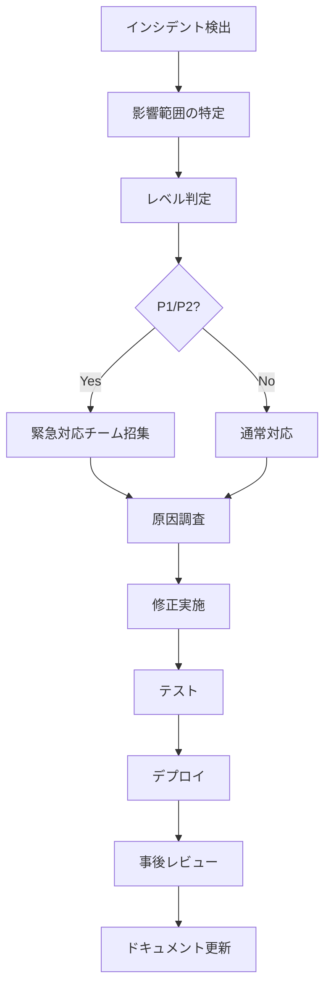

# セキュリティ設計書 - 予約管理システム

**作成日**: 2026-01-01
**プロジェクト**: 予約管理システム（美容室・歯科医院・整体院など多業種対応）
**バージョン**: 1.0.0
**セキュリティフレームワーク**: OWASP Top 10 準拠

---

## 📋 目次

- [セキュリティ概要](#セキュリティ概要)
- [認証・認可](#認証認可)
- [データ保護](#データ保護)
- [ネットワークセキュリティ](#ネットワークセキュリティ)
- [アプリケーションセキュリティ](#アプリケーションセキュリティ)
- [インフラストラクチャセキュリティ](#インフラストラクチャセキュリティ)
- [監査ログ](#監査ログ)
- [脆弱性管理](#脆弱性管理)
- [インシデント対応](#インシデント対応)

---

## 🔒 セキュリティ概要

### セキュリティ方針

**原則**:
1. **Defense in Depth（多層防御）**: 複数のセキュリティレイヤーで保護
2. **Least Privilege（最小権限の原則）**: 必要最低限の権限のみ付与
3. **Secure by Default（デフォルトで安全）**: セキュアな設定をデフォルトに
4. **Zero Trust（ゼロトラスト）**: すべてのリクエストを検証

### セキュリティスコープ

| レイヤー | 対策内容 |
|---------|---------|
| **アプリケーション** | 認証・認可、バリデーション、CSRF/XSS対策 |
| **データ** | 暗号化、マスキング、アクセス制御 |
| **ネットワーク** | HTTPS強制、セキュリティヘッダー、レート制限 |
| **インフラ** | 環境変数管理、依存関係管理 |
| **運用** | 監査ログ、脆弱性スキャン、インシデント対応 |

### OWASP Top 10 対応状況

| # | 脅威 | 対策状況 | 実装詳細 |
|---|------|---------|---------|
| 1 | Broken Access Control | ✅ 対応済み | 認証・認可チェック実装 |
| 2 | Cryptographic Failures | ⚠️ 部分対応 | Supabase暗号化、HTTPS強制（要改善：パスワードポリシー） |
| 3 | Injection | ✅ 対応済み | Prisma ORM（パラメータ化クエリ）、Zodバリデーション |
| 4 | Insecure Design | ✅ 対応済み | マルチテナント設計、テストカバレッジ85% |
| 5 | Security Misconfiguration | ⚠️ 部分対応 | 環境変数管理（要改善：セキュリティヘッダー） |
| 6 | Vulnerable Components | ✅ 対応済み | npm audit、Dependabot |
| 7 | Identification and Authentication | ⚠️ 部分対応 | Supabase Auth（要改善：MFA、パスワードポリシー） |
| 8 | Software and Data Integrity | ✅ 対応済み | CI/CDパイプライン、コード署名 |
| 9 | Security Logging & Monitoring | ❌ 未対応 | 要実装：監査ログ、異常検知 |
| 10 | Server-Side Request Forgery | ✅ 対応済み | 外部リクエストなし |

**凡例**:
- ✅ 対応済み
- ⚠️ 部分対応（改善必要）
- ❌ 未対応

---

## 🔐 認証・認可

### 認証方式

**実装**: Supabase Auth

**認証フロー**:
1. ユーザーがメールアドレス・パスワードでログイン
2. Supabase AuthがJWTトークンを発行
3. トークンをCookieに保存（httpOnly, secure, sameSite）
4. サーバーサイドでトークンを検証

**実装コード** (`lib/auth.ts`):
```typescript
/**
 * 現在のログインユーザーを取得
 */
export async function getCurrentUser(): Promise<User | null> {
  const supabase = await createClient();
  const { data: { user }, error } = await supabase.auth.getUser();

  if (error || !user) {
    return null;
  }

  return user;
}

/**
 * 認証が必要なページで使用
 */
export async function requireAuth(): Promise<User> {
  const user = await getCurrentUser();

  if (!user) {
    redirect('/login');
  }

  return user;
}

/**
 * 管理者権限が必要なページで使用
 */
export async function requireAdmin(): Promise<User> {
  const user = await requireAuth();

  if (!isAdmin(user.email)) {
    redirect('/');
  }

  return user;
}
```

### 認証トークン管理

**トークン保存方法**:
- **Cookie** (`httpOnly`, `secure`, `sameSite=lax`)
- **有効期限**: 1時間（アクセストークン）、7日間（リフレッシュトークン）

**セキュリティ設定**:
```typescript
const cookieOptions = {
  httpOnly: true,      // JavaScriptからアクセス不可（XSS対策）
  secure: true,        // HTTPS通信のみ
  sameSite: 'lax',     // CSRF対策
  maxAge: 3600,        // 1時間
  path: '/',
};
```

### 認可（権限管理）

**ロール定義**:

| ロール | 説明 | 判定方法 |
|-------|------|---------|
| **一般ユーザー** | 自分の予約のみ閲覧・作成・キャンセル可能 | `getCurrentUser()` |
| **管理者** | 全ユーザーの予約管理、スタッフ管理、統計閲覧可能 | `isAdmin(email)` |

**管理者判定** (`lib/auth.ts`):
```typescript
export function isAdmin(email?: string): boolean {
  if (!email) return false;

  const adminEmails = process.env.NEXT_PUBLIC_ADMIN_EMAILS?.split(',') || [];
  return adminEmails.includes(email);
}
```

**API認可チェック例** (`api/admin/stats/route.ts`):
```typescript
export async function GET(request: Request) {
  await requireAdmin(); // 管理者でない場合はリダイレクト

  // 統計情報を返す
}
```

### パスワードポリシー

**現在の実装** (`lib/validations.ts`):
```typescript
password: z
  .string()
  .min(8, 'パスワードは8文字以上で入力してください')
  .max(100, 'パスワードは100文字以内で入力してください')
  .regex(/[a-zA-Z]/, 'パスワードには少なくとも1つの英字を含めてください')
  .regex(/[0-9]/, 'パスワードには少なくとも1つの数字を含めてください')
```

**⚠️ 改善必要（GitHub Issue #65）**:
- [ ] 特殊文字を必須にする
- [ ] パスワード履歴チェック（過去3回のパスワードと同じものは不可）
- [ ] パスワード有効期限（90日）
- [ ] よくあるパスワード（`password123`など）を禁止

---

## 🛡️ データ保護

### データ暗号化

**保存時の暗号化（Encryption at Rest）**:
- **データベース**: Supabase PostgreSQL（AES-256暗号化）
- **環境変数**: Vercel Secrets（暗号化保存）

**通信時の暗号化（Encryption in Transit）**:
- **HTTPS/TLS 1.3**: すべての通信をHTTPSで暗号化
- **データベース接続**: SSL/TLS接続

### 個人情報保護

**取り扱う個人情報**:
- 氏名
- メールアドレス
- 電話番号
- 予約履歴

**保護対策**:
1. **マルチテナント分離**: `tenant_id` で完全分離
2. **アクセス制御**: ユーザーは自分のデータのみアクセス可能
3. **監査ログ**: アクセス履歴を記録（要実装）
4. **データマスキング**: ログ出力時にメールアドレス・電話番号をマスキング

**マスキング実装例**:
```typescript
function maskEmail(email: string): string {
  const [user, domain] = email.split('@');
  return `${user.slice(0, 2)}***@${domain}`;
}

function maskPhone(phone: string): string {
  return phone.slice(0, 3) + '-****-' + phone.slice(-4);
}
```

### データ保持ポリシー

| データ種別 | 保持期間 | 削除方法 |
|----------|---------|---------|
| **予約データ** | 完了後2年間 | 自動削除（バッチ処理） |
| **ユーザーアカウント** | アカウント削除まで | ユーザーリクエストにより論理削除 |
| **監査ログ** | 1年間 | 自動削除 |

---

## 🌐 ネットワークセキュリティ

### HTTPS強制

**実装**: Vercelデフォルトで HTTPS強制

**設定** (`next.config.ts`):
```typescript
const nextConfig = {
  async headers() {
    return [
      {
        source: '/:path*',
        headers: [
          {
            key: 'Strict-Transport-Security',
            value: 'max-age=31536000; includeSubDomains',
          },
        ],
      },
    ];
  },
};
```

### セキュリティヘッダー

**⚠️ 改善必要（GitHub Issue #62）**:

現在未実装のため、以下のヘッダーを追加する必要があります:

```typescript
// next.config.ts に追加予定
const securityHeaders = [
  {
    key: 'X-Frame-Options',
    value: 'DENY',
  },
  {
    key: 'X-Content-Type-Options',
    value: 'nosniff',
  },
  {
    key: 'X-XSS-Protection',
    value: '1; mode=block',
  },
  {
    key: 'Referrer-Policy',
    value: 'strict-origin-when-cross-origin',
  },
  {
    key: 'Permissions-Policy',
    value: 'camera=(), microphone=(), geolocation=()',
  },
  {
    key: 'Content-Security-Policy',
    value: "default-src 'self'; script-src 'self' 'unsafe-inline' 'unsafe-eval'; style-src 'self' 'unsafe-inline'; img-src 'self' data: https:; font-src 'self' data:;",
  },
];
```

### レート制限

**⚠️ 改善必要（GitHub Issue #63）**:

APIエンドポイントへのレート制限を実装する必要があります。

**実装予定** (`middleware.ts`):
```typescript
import { Ratelimit } from '@upstash/ratelimit';
import { Redis } from '@upstash/redis';

const ratelimit = new Ratelimit({
  redis: Redis.fromEnv(),
  limiter: Ratelimit.slidingWindow(10, '10 s'), // 10秒間に10リクエスト
});

export async function middleware(request: NextRequest) {
  const ip = request.ip ?? '127.0.0.1';
  const { success } = await ratelimit.limit(ip);

  if (!success) {
    return NextResponse.json(
      { error: 'Too many requests' },
      { status: 429 }
    );
  }

  return NextResponse.next();
}
```

**レート制限設定**:

| エンドポイント | 制限 | 説明 |
|--------------|------|------|
| `/api/auth/login` | 5回/分/IP | ブルートフォース攻撃対策 |
| `/api/auth/register` | 3回/時/IP | スパム登録防止 |
| `/api/**` | 100回/分/ユーザー | 通常のAPI利用 |

---

## 🔧 アプリケーションセキュリティ

### SQL インジェクション対策

**対策**: Prisma ORM 使用（パラメータ化クエリ）

**安全な実装例** (`api/reservations/route.ts`):
```typescript
// ✅ GOOD: Prisma ORMによる自動エスケープ
const reservations = await prisma.restaurantReservation.findMany({
  where: {
    tenantId: TENANT_ID,
    userId: user.id,
  },
});
```

**危険な実装例（避けるべき）**:
```typescript
// ❌ BAD: 生SQLを直接実行（使用禁止）
const result = await prisma.$queryRaw`
  SELECT * FROM reservations WHERE user_id = ${userId}
`;
```

**Raw SQLを使う場合**:
- 必ず `$queryRaw` の テンプレートリテラル記法を使用
- ユーザー入力は必ずバリデーション

---

### XSS（クロスサイトスクリプティング）対策

**対策**:
1. **React デフォルトエスケープ**: JSX内の文字列は自動エスケープ
2. **`dangerouslySetInnerHTML` 使用禁止**: HTMLを直接挿入しない
3. **Content Security Policy (CSP)**: 外部スクリプト実行を制限（要実装）

**安全な実装例**:
```tsx
// ✅ GOOD: 自動エスケープ
<p>{reservation.notes}</p>

// ❌ BAD: 危険（使用禁止）
<div dangerouslySetInnerHTML={{ __html: reservation.notes }} />
```

---

### CSRF（クロスサイトリクエストフォージェリ）対策

**⚠️ 改善必要（GitHub Issue #64）**:

**現在の対策**:
- Cookie の `sameSite=lax` 設定（部分的な対策）

**実装予定**:
- CSRFトークンの発行と検証
- ダブルサブミット Cookie パターン

**実装例**:
```typescript
// middleware.ts（実装予定）
import { csrf } from '@/lib/csrf';

export async function middleware(request: NextRequest) {
  // POSTリクエストのCSRFトークン検証
  if (request.method === 'POST') {
    const valid = await csrf.verify(request);
    if (!valid) {
      return NextResponse.json(
        { error: 'Invalid CSRF token' },
        { status: 403 }
      );
    }
  }

  return NextResponse.next();
}
```

---

### 入力バリデーション

**実装**: Zod スキーマバリデーション

**バリデーション例** (`lib/validations.ts`):
```typescript
export const createReservationSchema = z.object({
  menuId: z.string().uuid('Invalid menu ID'),
  staffId: z.string().uuid('Invalid staff ID'),
  reservedDate: z
    .string()
    .regex(dateRegex, 'Date must be in YYYY-MM-DD format')
    .refine((date) => {
      const selectedDate = new Date(date);
      const today = new Date();
      today.setHours(0, 0, 0, 0);
      return selectedDate >= today;
    }, 'Reservation date must be today or in the future'),
  reservedTime: z.string().regex(timeRegex, 'Time must be in HH:mm format'),
  notes: z.string().max(500, 'Notes must be 500 characters or less').optional(),
});
```

**バリデーション原則**:
1. **ホワイトリスト方式**: 許可する値のみ受け入れる
2. **型チェック**: 文字列・数値・UUIDなどの型を厳密にチェック
3. **長さ制限**: 文字列の最大長を制限（DoS対策）
4. **フォーマット検証**: 正規表現で形式をチェック

---

### ファイルアップロード

**現状**: ファイルアップロード機能は未実装

**将来実装する場合の要件**:
- ファイルタイプ検証（MIMEタイプ + 拡張子）
- ファイルサイズ制限（最大10MB）
- ウイルススキャン
- 安全なストレージ（Supabase Storage）
- ファイル名のサニタイズ

---

## 🏗️ インフラストラクチャセキュリティ

### 環境変数管理

**管理方法**:
- **開発環境**: `.env.local`（Gitに含めない）
- **本番環境**: Vercel Environment Variables（暗号化保存）

**環境変数一覧** (`.env.example`):
```bash
# Database
DATABASE_URL="postgresql://..."

# Supabase
NEXT_PUBLIC_SUPABASE_URL="https://..."
NEXT_PUBLIC_SUPABASE_ANON_KEY="..."
SUPABASE_SERVICE_ROLE_KEY="..."

# Email
RESEND_API_KEY="..."

# Auth
NEXT_PUBLIC_ADMIN_EMAILS="admin@example.com,manager@example.com"

# Multi-tenant
NEXT_PUBLIC_TENANT_ID="demo-booking"
```

**セキュリティルール**:
1. **秘密鍵はコミットしない**: `.env.local` を `.gitignore` に追加
2. **環境変数ローテーション**: 定期的に鍵を更新
3. **最小権限**: APIキーは必要最低限の権限のみ付与

---

### 依存関係管理

**脆弱性スキャン**:
- **npm audit**: 定期的に実行
- **Dependabot**: GitHub で自動依存関係更新

**実行コマンド**:
```bash
# 脆弱性チェック
npm audit

# 高・致命的な脆弱性のみ表示
npm audit --audit-level=high

# 自動修正
npm audit fix
```

**最新の監査結果**（2026-01-01）:
```
0 vulnerabilities found
```

---

### CI/CD セキュリティ

**GitHub Actions ワークフロー** (`.github/workflows/ci.yml`):

**セキュリティチェック項目**:
1. **依存関係チェック**: `npm audit`
2. **Lintチェック**: `npm run lint`
3. **型チェック**: `npm run build:ci`
4. **テスト実行**: `npm test`（カバレッジ85%以上）

**実装例**:
```yaml
- name: Run security audit
  run: npm audit --audit-level=high

- name: Run tests with coverage
  run: npm run test:coverage
```

---

## 📊 監査ログ

**⚠️ 改善必要（GitHub Issue #67）**:

### 記録すべきイベント

| カテゴリ | イベント | 記録内容 |
|---------|---------|---------|
| **認証** | ログイン成功/失敗 | ユーザーID、IP、タイムスタンプ |
| **認証** | ログアウト | ユーザーID、タイムスタンプ |
| **認証** | パスワード変更 | ユーザーID、タイムスタンプ |
| **認可** | 管理者ページアクセス | ユーザーID、ページURL、タイムスタンプ |
| **データ操作** | 予約作成・変更・削除 | ユーザーID、予約ID、操作内容、タイムスタンプ |
| **データ操作** | スタッフ作成・変更・削除 | 管理者ID、スタッフID、操作内容、タイムスタンプ |
| **エラー** | 認証エラー | IP、エラー内容、タイムスタンプ |
| **エラー** | 権限エラー | ユーザーID、アクセス試行URL、タイムスタンプ |

### ログフォーマット

**実装予定** (`lib/audit-log.ts`):
```typescript
interface AuditLog {
  id: string;
  timestamp: Date;
  userId?: string;
  ipAddress: string;
  userAgent: string;
  eventType: 'AUTH' | 'DATA' | 'ERROR';
  eventAction: string;
  resourceType?: string;
  resourceId?: string;
  result: 'SUCCESS' | 'FAILURE';
  details?: Record<string, unknown>;
}

async function logAuditEvent(log: AuditLog) {
  await prisma.auditLog.create({ data: log });
}
```

### ログ保持期間

- **認証ログ**: 1年間
- **データ操作ログ**: 2年間
- **エラーログ**: 6ヶ月間

---

## 🔍 脆弱性管理

### 脆弱性スキャンスケジュール

| スキャン種別 | 頻度 | ツール |
|------------|------|-------|
| **依存関係スキャン** | 毎日（自動） | Dependabot |
| **コード品質チェック** | PR毎 | ESLint, TypeScript |
| **テストカバレッジ** | PR毎 | Jest (85%以上) |
| **手動セキュリティレビュー** | 月次 | 開発者レビュー |

### 脆弱性対応プロセス

**発見から対応まで**:

1. **検出**: Dependabot / npm audit / 手動発見
2. **評価**: CVSS スコアによる深刻度判定
   - **Critical (9.0-10.0)**: 即座に対応（24時間以内）
   - **High (7.0-8.9)**: 1週間以内に対応
   - **Medium (4.0-6.9)**: 1ヶ月以内に対応
   - **Low (0.1-3.9)**: 次回リリース時に対応
3. **修正**: パッチ適用 / 回避策実施
4. **テスト**: 修正内容の動作確認
5. **デプロイ**: 本番環境へのリリース
6. **ドキュメント更新**: 対応履歴を記録

---

## 🚨 インシデント対応

### インシデント分類

| レベル | 定義 | 例 | 対応時間 |
|-------|------|---|---------|
| **P1（緊急）** | サービス停止、データ漏洩 | DB侵害、認証バイパス | 即座（1時間以内） |
| **P2（高）** | 一部機能停止、セキュリティリスク | XSS脆弱性、APIレート制限突破 | 4時間以内 |
| **P3（中）** | 軽微な不具合 | 入力バリデーション漏れ | 1営業日以内 |
| **P4（低）** | 改善要望 | ログ出力の改善 | 次回リリース |

### インシデント対応フロー



### 連絡体制

**緊急連絡先**:
- プロジェクトオーナー: [メールアドレス]
- インフラ担当: [メールアドレス]
- セキュリティ担当: [メールアドレス]

---

## 📋 セキュリティチェックリスト

### デプロイ前チェック

- [ ] 環境変数が正しく設定されているか
- [ ] `npm audit` で脆弱性がないか
- [ ] 全テストが通過しているか
- [ ] セキュリティヘッダーが設定されているか
- [ ] HTTPS通信が強制されているか
- [ ] CSRFトークンが実装されているか
- [ ] レート制限が設定されているか
- [ ] 監査ログが記録されているか
- [ ] エラーメッセージが機密情報を含まないか
- [ ] デフォルト管理者パスワードが変更されているか

### 定期レビュー項目（月次）

- [ ] 依存関係の更新確認
- [ ] 監査ログの確認
- [ ] アクセス権限の棚卸し
- [ ] 不要なユーザーアカウントの削除
- [ ] パスワードポリシーの遵守状況確認
- [ ] バックアップの動作確認

---

## 🔧 改善予定項目（GitHub Issues）

### 優先度: 高

| Issue # | タイトル | 説明 | 期限 |
|---------|---------|------|------|
| #62 | セキュリティヘッダー実装 | CSP, X-Frame-Options等の追加 | 2週間以内 |
| #63 | レート制限実装 | APIエンドポイントへのレート制限 | 2週間以内 |
| #64 | CSRF保護実装 | CSRFトークンの発行と検証 | 2週間以内 |
| #67 | セキュリティ監査ログ実装 | 認証・データ操作の監査ログ記録 | 1ヶ月以内 |

### 優先度: 中

| Issue # | タイトル | 説明 | 期限 |
|---------|---------|------|------|
| #65 | パスワードポリシー強化 | 特殊文字必須化、履歴チェック | 1ヶ月以内 |
| #66 | Next.js Middleware実装 | 認証チェックの一元化 | 1ヶ月以内 |

---

## 📚 参考資料

### セキュリティガイドライン

- [OWASP Top 10 2021](https://owasp.org/Top10/)
- [Next.js Security Best Practices](https://nextjs.org/docs/app/building-your-application/security)
- [Supabase Security Guide](https://supabase.com/docs/guides/platform/security)
- [Vercel Security](https://vercel.com/docs/security)

### 関連ドキュメント

- **API設計書**: `documents/api/API設計書.md`
- **ルート設計書**: `documents/basic/ルート設計書.md`
- **データベース設計書**: `documents/spec/データベース設計書.md`

---

**最終更新**: 2026-01-01
**管理者**: Claude Code
**次回レビュー予定**: 2026-02-01
